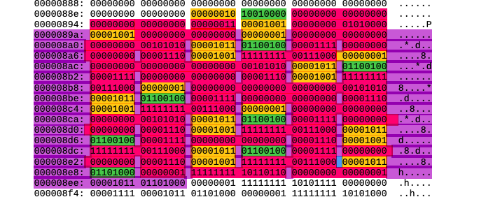

# corewar
## первая часть
- [X] Kolya pishet readme.txt
- [ ] парсим файл
- [ ] Tanya пишем ассемблер
- [ ] Таня пишет вм
- [ ] сдаем
- [ ] отмечаем

# Шутки закончились
- Обработанные команды кладутся в вектор чаров
- Мы встречаем название команды. Передаем строчку в функицю, которая обрабатывает данную команду

- Мы встречаем метку (название метки не может быть таким же как название какой либо из команд, а ее первое упоминание заканчивается на ":")
Если после обработки строки с меткой, она не стала NULL, то в ней есть команда - запускается функция, обрабатывающая команду.
Если после обработки строки с меткой, она стала NULL, то следующая строчка является ***помеченной командой***.

# Идея обработки метки в аргументах команд
Разберем на примере "zjmp %:avantdebut"

zjmp функция принимает один аргумент размером в 2 байта. Вместо прямого аргумента эта функция принимает метку. Поскольку мы не знаем, сколько байт вперед или назад нужно пройти, чтобы добраться до метки  "avantdebut" мы записываем на место аргумента 2 байта нулей и запоминаем индексы конца и начала интервала всталения метки.

P.S Если хотите внести свою лепту в написание компилятора, то переходите на ветку assembler

### картиночка для компилятора
 
- желтый *код комманды (указан в таблице)*
- зеленый *тип аргументов (если есть)*
- розовый *аргументы (могут занимать от 2 до 4 байт)*
- фиолетовый *отмечен участок на который был сделан прыжок* 
